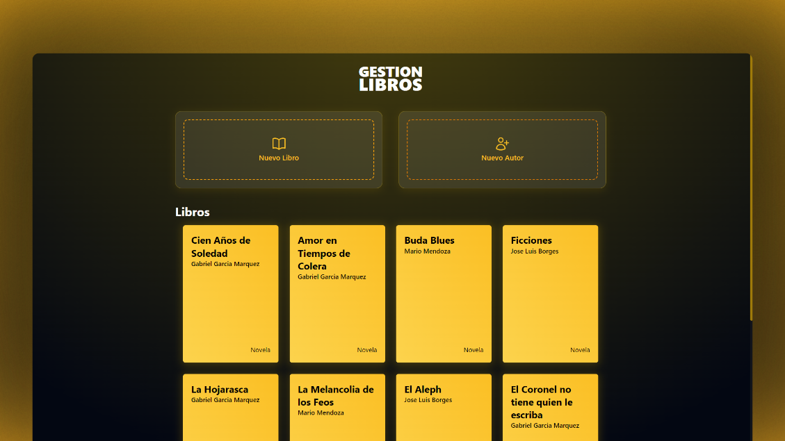
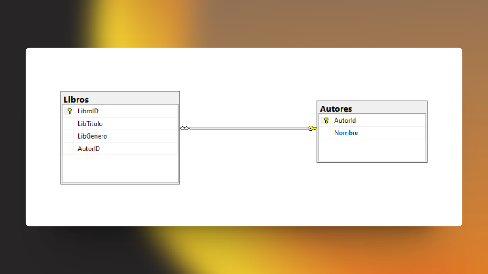

# 📖 Gestion Libreria - Prueba tecnica

Este es el repositorio de un proyecto simple de Gestión de Libreria hecho en ASP.NET MVC. Donde se pueden ver los Libros en la pagina principal, más dos opciones de agregar un Libro y un Autor



### 💡 Tecnologias Utilizadas

- Entity Framework Core
- Tailwind CSS
- Microsoft SQL Server Managment

## 🚀 Comenzando

Clonar proyecto atravez de Git

```bash
git clone https://github.com/G4BO11/GestionLibreria-PruebaTecnica.git
```

Clonar proyecto atravez de GitHub CLI

```shell
gh repo clone G4BO11/GestionLibreria-PruebaTecnica
```

Descargar .NET (En caso de no tener .NET en el computador)

[](https://stackblitz.com/github/withastro/astro/tree/latest/examples/basics)

Iniciar proyecto atravez de la terminal

```shell
dotnet run
```

## 🧞 Comandos

Estos son los comandos que puedes utilizar en la terminal para ejecutar el proyecto si es necesario:

| Comando                        | Accion                                |
| :----------------------------- | :------------------------------------ |
| `pnpm install` o `npm install` | Instalar Dependecias (tailwind)       |
| `dotnet --version`             | Te muestra que version de .NET tienes |
| `dotnet run`                   | Ejecuta el proyecto                   |

## 🗃️ Diagrama Entidad Relacion

> **NOTA:** En el modelo no se requiere la casilla Genero, Sin embargo se puso como agregado para la maquetación


