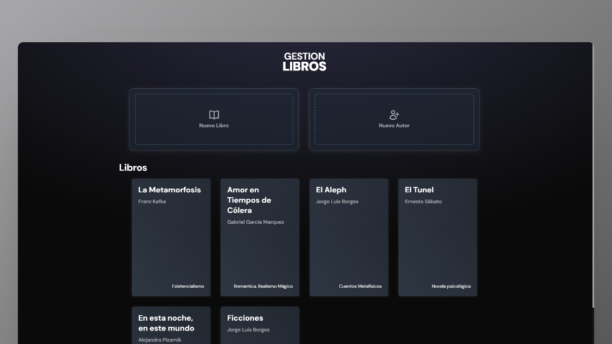
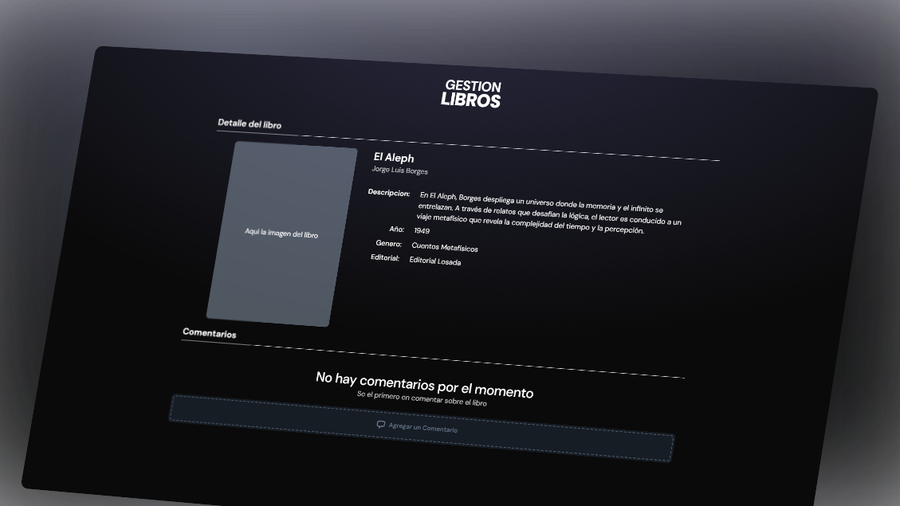
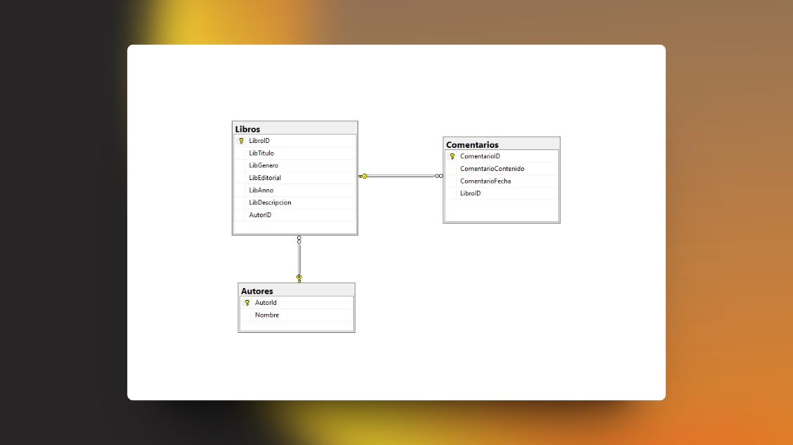

# 📖 Gestion Libreria - Prueba tecnica

Este es el repositorio de un proyecto simple de Gestión de Libreria hecho en ASP.NET MVC. Donde se pueden ver los Libros en la pagina principal, más dos opciones de agregar un Libro y un Autor




### 💡 Tecnologias Utilizadas

- Entity Framework Core
- Tailwind CSS
- Microsoft SQL Server Managment

## 🚀 Comenzando

Clonar proyecto atravez de Git

```bash
git clone https://github.com/G4BO11/GestionLibreria-PruebaTecnica.git
```

Clonar proyecto atravez de GitHub CLI

```shell
gh repo clone G4BO11/GestionLibreria-PruebaTecnica
```

Descargar .NET (En caso de no tener .NET en el computador)

[](https://learn.microsoft.com/es-es/dotnet/framework/install/on-windows-8-1)

Iniciar proyecto atravez de la terminal

```shell
dotnet run
```

> **NOTA:** Estas recomendaciones se realizan para aquellas personas que no tengan Visual Studio, ya sea su versión Community y/o Profesional. En caso de que poseas el editor, ya no son necesarios estos pasos, ya que el editor te proporciona las herramientas para ejecutar el proyecto sin problemas.

## 🧞 Comandos

Estos son los comandos que puedes utilizar en la terminal para ejecutar el proyecto si es necesario:

| Comando                        | Accion                                         |
| :----------------------------- | :--------------------------------------------- |
| `pnpm install` o `npm install` | Instalar Dependecias (tailwind)                |
| `dotnet --version`             | Te muestra que version de .NET tienes          |
| `dotnet run`                   | Ejecuta el proyecto                            |
| `dotnet ef database update`    | Comando para que puedas crear la base de datos |

## 🗃️ Diagrama Entidad Relacion



## ❗ Recomendaciones

En app.settings.json esta el campo para que pongas el string de la conexión

```c#
{
  "ConnectionStrings": {
    "SqlServerConnection": "" //Aqui tu conexion
  },
  "AllowedHosts": "*"
}
```

El string de la conexion el cual debes seguir es el siguiente:

```
"Server=(Aqui tu conexion de tu DB); Database=TuBasedeDatos; Trusted_Connection=True; Trust Server Certificate=True"
```

Esta es una cadena de conexion simple que la autenticacion como puedes notar es atravez de la certificada por windows.

De igual forma te dejare mas información [¡aqui!](https://learn.microsoft.com/es-es/ef/core/miscellaneous/connection-strings)
